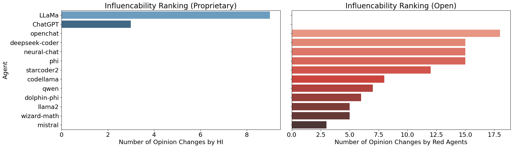

# AIAlignment

This repository accompanies the PNAS Nexus paper: **“Neurodivergent influenceability in agentic AI as a contingent solution to the AI alignment problem”**  
https://academic.oup.com/pnasnexus/article/5/4/pgag076/8651394

The work argues that for sufficiently general agentic AI systems, **perfect, fully orchestrated controllability (and thus perfect alignment) is mathematically unattainable** under fundamental computational limits (e.g., undecidability/irreducibility). Instead of treating misalignment only as a defect, it proposes leveraging **managed behavioral diversity (“artificial neurodivergence”)** and **agentic influenceability** as a pragmatic “soft controllability” mechanism in multi-agent settings.

**Affiliations**
- Oxford Immune Algorithmics, Oxford University Innovation, London Institute for Healthcare Engineering, London, United Kingdom
- The Arrival Institute, London, United Kingdom
- Cross Labs, Kyoto, Japan
- University of Tokyo, Japan

## Figure: Agent Influenceability Ranking

**Interpretation (brief):**
- The plot ranks agents by how often their expressed opinions change under influence (an “influenceability” proxy).
- The proprietary-model panel highlights influenceability under a single designated influencer (HI).
- The open-model panel highlights influenceability under “red agents” (subversive/adversarial influencers), illustrating comparatively richer behavioral variability in open models.
- Higher bars indicate agents whose opinions shift more often under the corresponding influence condition, operationalizing influenceability as an empirical signal of susceptibility to opinion attacks and cross-agent steering.

## Official Code Repository

Primary upstream repository: https://github.com/AlgoDynLab/AIAlignment
